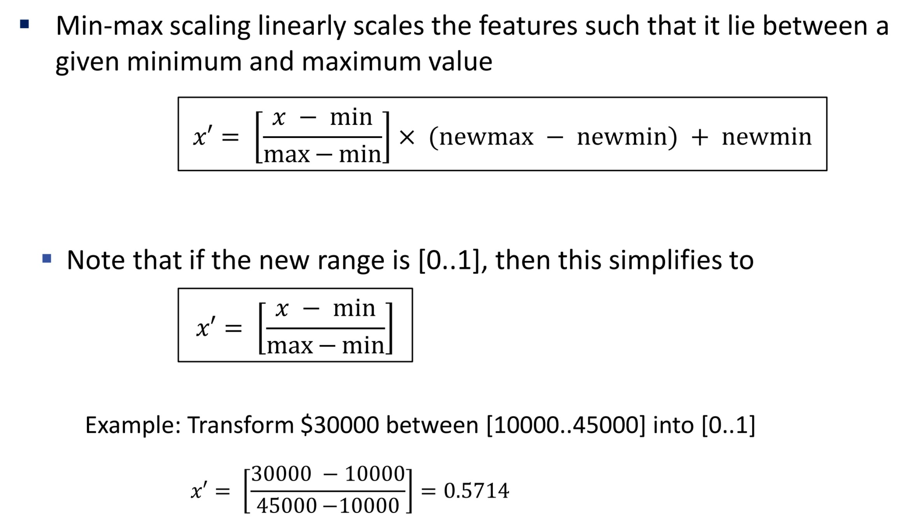

# LECTURE 3: The Regression Pipeline

[TOC]

## Regression

### General Plan

1. Learn a function (parameter/ hypothesis function)
2. Map the input features, $x$
3. To targeted variable, $y$

### I/O

Input features, $x$ usually a **matrix** (represented using `pd.DataFrame()`)

| Size (feet^2^) | Age of home (years) |
| -------------- | ------------------- |
| 2104           | 45                  |
| 1416           | 40                  |
| 1534           | 30                  |
| 852            | 36                  |
| 750            | 12                  |

Output vector $y$, of size (m, ) ==**if (m, ) means rank 1**==

| Price |
| ----- |
| 460   |
| 232   |
| 315   |
| 178   |

## California Housing

### Problem Statement

1. A **type of supervised learning** due to having **input features** and **output labels**.
2. **Regression task** because output is **continuous (price)**

### Explore Data

1. Look at data structure
2. Perform statistical analysis on the data
   - `df.describe()`
   - `df.hist()` - plots histogram for every features, **check capped values**
   - **Check scaling**
   - **Tail Heavy**
   - `df.attribute1.value_counts()`
3. Look for correlation
   - `df.corr()` - high corr makes ML hard to learn

### Data Preparation

Makes data more suitable for ML algorithms

1. Split into training and testing

   - **Never fine tune model using test set**
   - **Test set is used to evaluate how well model generalize to novel (unseen) data**
   - **2** types of sampling
     1. Random Sampling - from whole dataset (might be uneven)
     2. Stratified Sampling - **maintain the proportion of classes in each split**

2. Handle missing data

   - Remove missing values (only use on large dataset)
   - Fill in missing values with
     1. Global Constant, $0$
     2. **Mean/Median** of each attribute
     3. **Mean/Median** of each attribute **belonging to the same class**
     4. **Value** of similar samples

3. Data transformation

   - Feature Scaling is needed for estimators (**2** types)

     1. Min-max scaling

        

     2. Standardization (preferred)

        ​ $x' =  \frac{x - mean}{stddev}$

   - Label Encoding

     1. For ordinal data types, **higher** score for better, **lower** score for bad (e.g Low, Medium, High)
     2. For nominal data types, **order does not matter** (use One-hot encoding)

4. Data reduction (if necessary)

### Various Regression Algorithms

### Overfitting and Underfitting

Building a model on top of other models is called **Ensemble Learning**

Random Forest is built on Random Tree

### Cross Validation

#### Holdout Validation

Might overfit validation set

#### k-fold Validation

1. k usually odd
2. average estimates performance of model (**higher better**)
3. std tells you the reliability (if high, cross-validation error could be imprecise)
