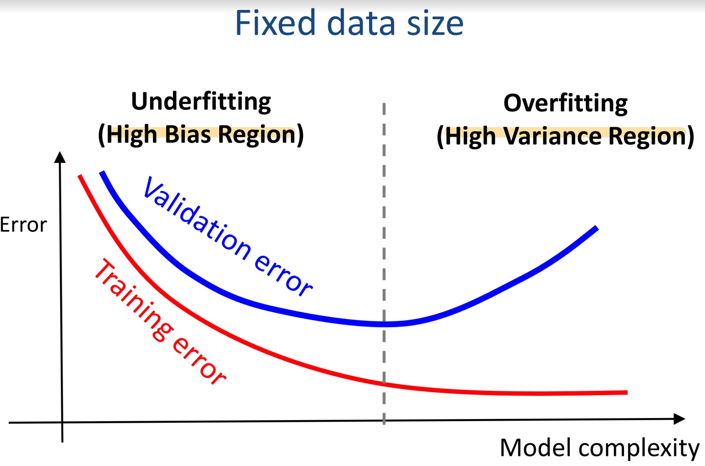

# Polynomial Regression

- [Polynomial Regression](#polynomial-regression)
  - [Overfitting and Underfitting](#overfitting-and-underfitting)
    - [Underfitting](#underfitting)
    - [Fixing Underfitting](#fixing-underfitting)
    - [Overfitting](#overfitting)
    - [Fixing Overfitting](#fixing-overfitting)
    - [Effect of model complexity](#effect-of-model-complexity)
    - [Effect of training size](#effect-of-training-size)
  - [Regularization](#regularization)
    - [Ridge (Tikhonov) Regression](#ridge-tikhonov-regression)
    - [Regularized Normal Equation](#regularized-normal-equation)
    - [Lasso Regression](#lasso-regression)
    - [Elastic Net](#elastic-net)

## Overfitting and Underfitting

Further explained from Chapter 2

### Underfitting

- Over-simplified
- Not sufficiently expressive
- a.k.a **high bias problem** (assuming it to be linear when it is actually quadratic)

### Fixing Underfitting

- Generate **additional feautres (non-linear terms)** from **existing feature set (polynomial transformation)**
- Add more useful features
- ==Adding new samples won't help==

### Overfitting

- Model too complex (e.g 3000 degree model)
- a.k.a **high variance problem** (model fits too specifically to traninig set, cannot adapt to unseen data)
- Excessively sensitive to small variations of training data (too many curves and turns)

### Fixing Overfitting

- Reduce number of feautres
  - Manually select which features to keep
  - Model selection algorithm
- Regularization
  - Keep all features, but reduce magnitude/values of parameters $\theta_{j}$
  - Works well when there is alot of features as each feature contributes a bit to predict y
- Adding more samples

### Effect of model complexity

### Effect of training size

Refer Slide 18 🔍

## Regularization

- Impose some **constraints** (e.g make param $\theta$ values smaller, not feature values!)
- To simplify model
- **Reduce overfitting**

### Ridge (Tikhonov) Regression

> **Strategy :** Enforce parameters $\theta$ to **prefer smaller values**

We add a **regularization term** to the cost function to **penalize** parameters with big values

$j(\theta)=MSE(\theta)+\alpha\frac{1}{2}\sum_{i=1}^{n}{\theta_i^2}$ **(non-vectorized)**

$j(\theta)=MSE(\theta)+\alpha\frac{1}{2}\theta^{T}\theta$ **(vectorized)**

**Note :** We don't regularize $\theta_{0}$

> **Regularization Strength, $\alpha$ :** Hyperparam.
> $\alpha = 0$, no reg.
> $\alpha > 0$, strong reg.

| $\alpha$ Value          | Errors                                            |
| ----------------------- | ------------------------------------------------- |
| Set Properly            | Train Error = Low, Val Error = Low                |
| Too Small (no reg.)     | Train Error = Low, Val Error = High (Overfitting) |
| Too large (strong reg.) | Train Error = High, Val Error = High              |

### Regularized Normal Equation

Original Normal Equation:

$\hat{\theta} = (X^{T}X)^{-1}X^{T}\cdot{y}$

**Regularized** Normal Equation:

$\hat{\theta} = (X^{T}X + \alpha{A})^{-1}X^{T}\cdot{y}$

> n: # features
> m: # samples
> Size of **X**: (m, n+1)
> Size of **y**: (m, )
> Size of **$\theta$**: (n+1, )

**A**: an (n+1) $\times$ (n+1) identity matrix except with a 0 on the top-left cell, corresponding to the bias term
$\alpha$: regularization strength

$$
\begin{bmatrix}
0 & 0 & 0 &... & 0\\
0 & 1 & 0 &... & 0\\
0 & 0 & 1 &... & 0\\
\end{bmatrix}
$$

### Lasso Regression

Lasso means **L**east **A**bsolute **S**hrinkage and **S**election **O**perator Regression

$J(\theta) = MSE(\theta) + \alpha{\sum_{i=1}^{n}}{|\theta_{i}|}$

- Generate solution that is **sparse** (most of weights are full of zeros)
- Eliminates the weights of the least important features (set them to 0)
  - This is an auto perform **feature selection**

### Elastic Net

The **middle ground** between **Ridge Regression** and **Lasso Regression**

$J(\theta) = MSE(\theta) + r\alpha{\sum_{i=1}^{n}{|\theta_{i}|}} + (1 - r)\alpha\frac{1}{2}\sum_{i=1}^{n}{\theta_{i}^{2}}$

$r = 0$: Elastic Net becomes Ridge Regression
$r = 1$: Elastic Net becomes Lasso Regression
