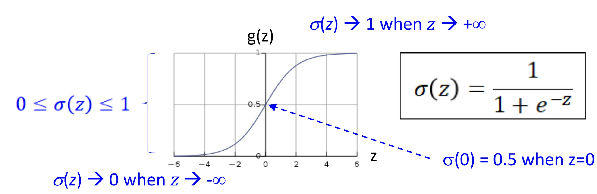
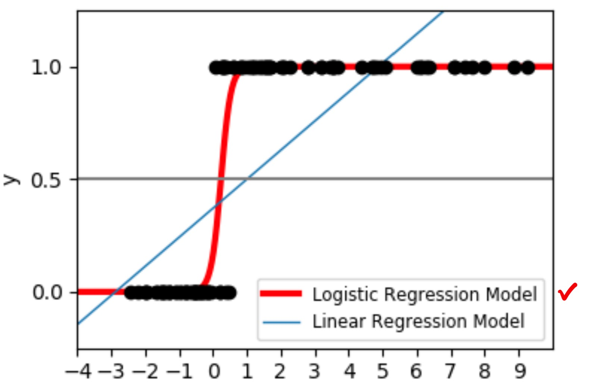
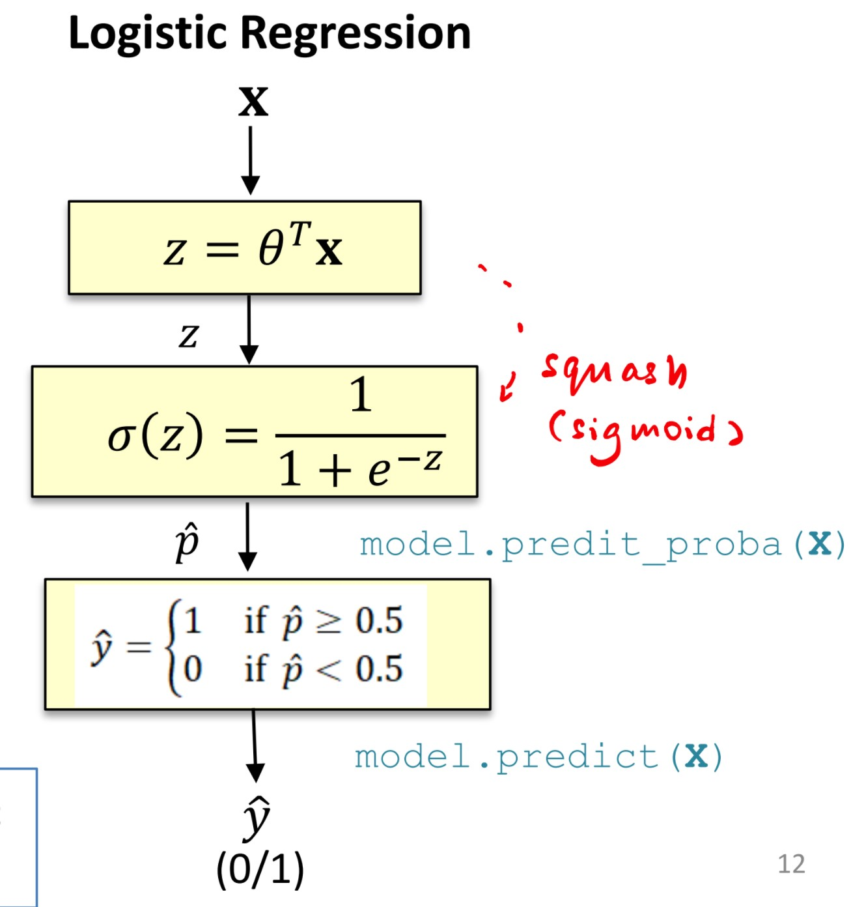
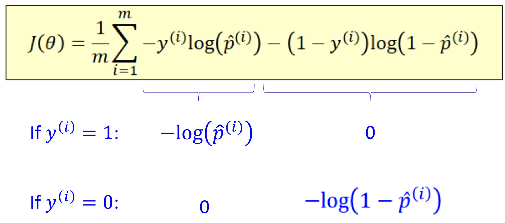

# Logistic Regression

- [Logistic Regression](#logistic-regression)
  - [Definition](#definition)
  - [Downsides](#downsides)
  - [Sigmoid Function](#sigmoid-function)
  - [Logistic Regression (Logit Regression)](#logistic-regression-logit-regression)
  - [Hypothesis Function](#hypothesis-function)
    - [For Single Sample](#for-single-sample)
    - [Vectorized (Multiple Samples)](#vectorized-multiple-samples)
  - [Interpreting Hypothesis Function](#interpreting-hypothesis-function)
  - [Logistic Regression Flow](#logistic-regression-flow)
  - [Best Parameters for Logit](#best-parameters-for-logit)
  - [Cross Entropy Loss](#cross-entropy-loss)
    - [Concise](#concise)
    - [Vectorized Concise](#vectorized-concise)
  - [Minimizing $J(\theta)$](#minimizing-jtheta)
  - [Decision Boundaries](#decision-boundaries)

## Definition

> **Def:** Using linear regression to perform **classification**

Steps

1. Fit the data using regression
2. Threshold the results into groups

## Downsides

Linear Regression for classification **is sensitive to noise**

To fix the downside

- the **hypothesis function** should have a shape that fit naturally to a binary classifier

## Sigmoid Function

Properties:

- S-shape
- Ranges between 0 and 1 (y-axis)

## Logistic Regression (Logit Regression)

When we obtain the prediction results

$z = \theta^{T}x$

We pass the results into the sigmoid function

$\sigma(z) = \frac{1}{1 + e^{-z}}$

Which is equivalent to

$h_{\theta}(x)$ has range of $[0,1]$

## Hypothesis Function

### For Single Sample

$h_{\theta}(x) = \sigma(\theta^{T}x) = \frac{1}{1 + e^{-\theta^{T}{x}}}$

### Vectorized (Multiple Samples)

$h_{\theta}(X) = \sigma(X\cdot\theta) = \frac{1}{1 + e^{-X\cdot\theta}}$

## Interpreting Hypothesis Function

Since $h(x)$ ranges between 0 and 1; it is **probability**

To be exact, the probability that $y=1$ given **x**

> $\hat{p} = h(x) = P(y = 1|x)$

Then $1 - h(x)$ is the probability of $y=0$ given **x**

> $1 - \hat{p} = 1 - h(x) = P(y = 0|x)$

So we say if $h(x) = 0.7$, then we can say that it has $70\%$ of belonging to +ve class

## Logistic Regression Flow

## Best Parameters for Logit

What is the suitable cost function for Logit?

No longer MSE because it is not convex!

## Cross Entropy Loss

The cost function for Logit

$J(\theta) = \frac{1}{m}\sum_{i=1}^{m}{c(\theta)}$

and

$c(\theta) = -\log{(\hat{p})}$ if y = 1
$c(\theta) = -\log{(1- \hat{p})}$ if y = 0

### Concise

### Vectorized Concise

$J(\theta) = \frac{1}{m}(-y^T\log(h) - (1-y)^T\log(1-h))$

## Minimizing $J(\theta)$

Gradient for GD

Gradient of $J(\theta) = \frac{1}{m}X^T(h(x^{(i)}-y)$

## Decision Boundaries

Can add polynomial features to make the decision boundary complicated (more variance)