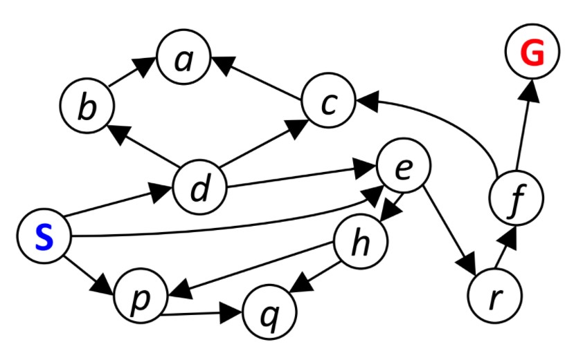
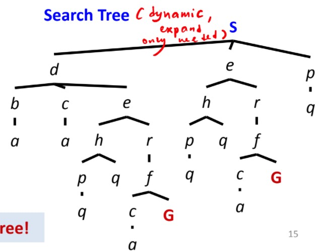
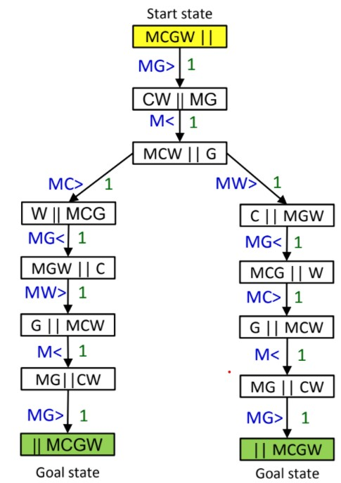
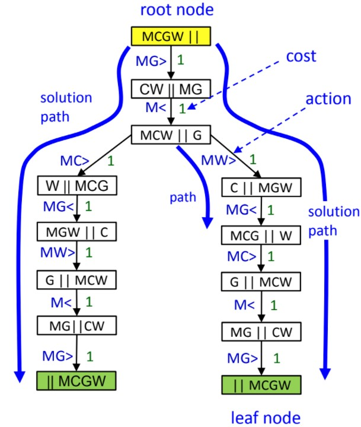

# Search Problem

- [Search Problem](#search-problem)
  - [Definition](#definition)
  - [Components of Search Problem](#components-of-search-problem)
  - [Solving Search Problems](#solving-search-problems)
  - [State Space Graph](#state-space-graph)
  - [Search Tree](#search-tree)
    - [Full Search Tree](#full-search-tree)
    - [Compenents of Search Tree](#compenents-of-search-tree)
    - [Effective Search Tree](#effective-search-tree)
  - [Effective Formulation](#effective-formulation)
  - [Evaluating Search Algorithms](#evaluating-search-algorithms)
    - [Evaluating Search Tree](#evaluating-search-tree)

## Definition

- Task of finding the sequence of actions/steps
- Leads to desired goal

## Components of Search Problem

A **search problem** contains the following

| Component          | Description                                                                                       |
| ------------------ | ------------------------------------------------------------------------------------------------- |
| State              | Set of all possible configurations                                                                |
| Successor function | Given a state, returns **list of possible actions** + **their corres. cost and resultant states** |
| Start State        | The initial state the **agent** begins                                                            |
| Goal Test          | Check wether a given state is in a goal state                                                     |

A **solution** is **a sequence of actions (plan)** which transform the start state to the goal state

## Solving Search Problems

General pipeline of **problem formulation**

1. Goal Formulation

   - Agent **adopts goal**
   - **Goal** : A set of world states in which the goal is satisfied

2. Problem Formulation (Define the following)

   - State
   - Successor Function (actions, cost)
   - Start and Goal State

3. Search for sol$^n$

   - Use **search algo.** to find the **best sequence of actions** that lead from **start state** to **goal state**

4. Execution
   - Agent executes the actions specified by the solution found

Use the pipeline for the river crossing problem (Slide 8 and Slide 9)

## State Space Graph

**Def :** Shows how states are related to each other in a search problem

| Element | Description                             |
| ------- | --------------------------------------- |
| Nodes   | Represents (abstracted) states          |
| Arcs    | Successors (possible actions and costs) |
| Goal    | Set of goal nodes (can be only one)     |

Each state can only **occur once**

This is very large (not practical)

## Search Tree

Expands Dynamically

### Full Search Tree

### Compenents of Search Tree

| Component             | Description                       |
| --------------------- | --------------------------------- |
| Root                  | Start State                       |
| Leaf                  | Goal State                        |
| Cost                  | Comes with the Action             |
| Action                | Represented by edge/arc           |
| Solution Path         | Path from Start to Goal           |
| Optimal Solution Path | Solution path with lowest cost    |
| Path                  | Series of actions between 2 nodes |

### Effective Search Tree

Built by the searching algorithm

> The smaller the better

## Effective Formulation

To reduce search time, use

1. Effective Search Algorithms
2. Effective Problem Formulation
   - Consider the search strategy
   - Don't generate invalid states

Consider the Queens Puzzle

We have 2 methods

1. **Complete State Formulation**
2. **Incremental Formulation**

## Evaluating Search Algorithms

Consider **4 factors**

1. Time Complexity
   - How long does it take to find a solution?
   - Measured in terms of no. of nodes generated during search

2. Space Complexity
   - How much mem needed?
   - Maximum no. of nodes stored in mem at a particular time

3. Completeness
   - Will a solution be guaranteed if it exists?
   - Measured whether the search tree is complete?

4. Optimality
   - Is the best solution found if several exists?
   - Measured in terms of **total search cost**

### Evaluating Search Tree

Params affecting the size of the tree

- **depth**
- **branching factor**

> **Depth :** The longest path from root to the deepest leaf node
> **Branching Factor :** A constant number indicating the amount of ndoes that are expanded at a given depth in a ST

Example (Branching Factor):

Assuming branching factor b, the no. of nodes that are expanded at depth d is given by

$1 + b + b^2 + b^3 + ... + b^d$

So assuming $b = 2$ and $d = 2$, the no.of nodes that are expanded at depth 2 are:

$1 + 2 + 2^2 = 7$ nodes (Cumulative no. of nodes from root to that depth)
