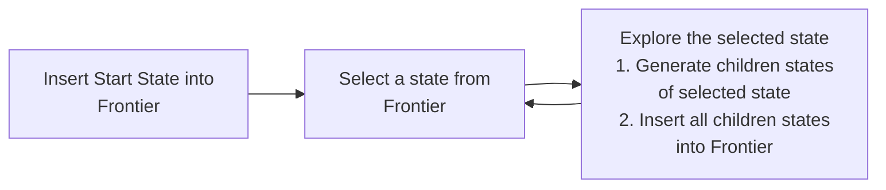
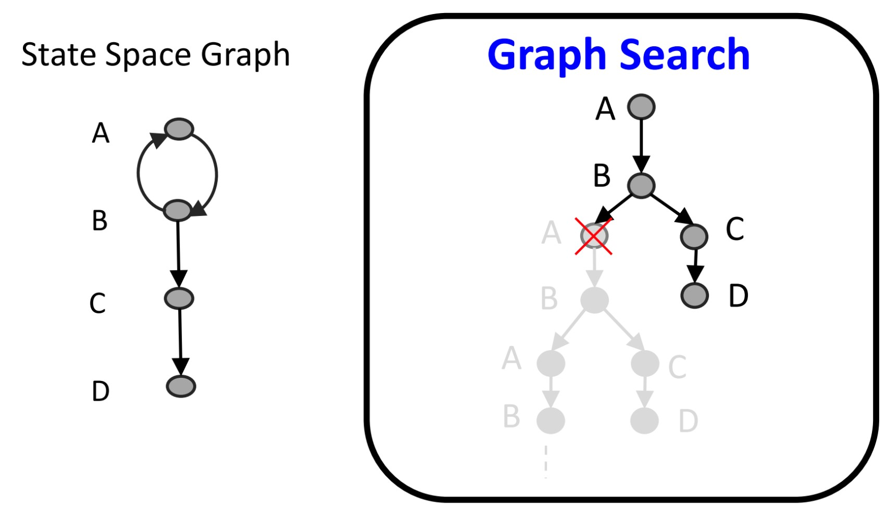
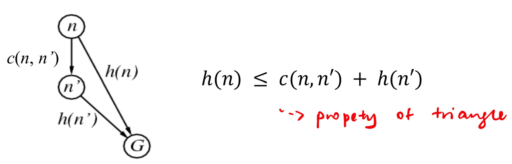

# Search Algorithms

- [Search Algorithms](#search-algorithms)
  - [General Search Framework](#general-search-framework)
    - [General Tree Search](#general-tree-search)
    - [General Graph Search](#general-graph-search)
  - [Uniform Search Algorithms](#uniform-search-algorithms)
    - [Breadth First Search (BFS)](#breadth-first-search-bfs)
    - [Depth First Search (DFS)](#depth-first-search-dfs)
    - [Iterative Deepening DFS (IDS)](#iterative-deepening-dfs-ids)
    - [Optimality](#optimality)
    - [Uniform Cost Search (UCS)](#uniform-cost-search-ucs)
  - [Informed Search](#informed-search)
    - [Heuristic Function](#heuristic-function)
    - [A* Search](#a-search)
      - [Admissibility Requirement for A* Graph Search](#admissibility-requirement-for-a-graph-search)
      - [Consistency Requirement for A* Graph Search](#consistency-requirement-for-a-graph-search)
    - [A* Search Evaluation](#a-search-evaluation)
    - [Choosing Heuristics](#choosing-heuristics)

## General Search Framework

Use 2 arrays

> **Frontier :** Store unexplored states
> **Explored :** Store explored states (if don't want to re-explore)

Repeat until solution is found (success) or lost (failure)

### General Tree Search

- There is **repeated states** (Will result in infinite size tree)
- Goal states are checked when a node is explored (not when generated)

### General Graph Search

There is **no repeated states** (Make use of **explored** array)

> Check out both Tree and Graph Search flowchart in lecture slides 🎗

## Uniform Search Algorithms

Each Algorithm has its Tree (repeat) and Graph (no repeat) variants

### Breadth First Search (BFS)

- Starts with the **shallowest** nodes in the frontier first
- Nodes are explored **lvl by lvl**
- **FIFO Strategy** (Use a **Queue**)
- Stop when **goal node found (success)** or **no more nodes to expand (failure)**
- Always returns the shallowest solution at depth **s**

> **Cost is not considered** in BFS **(Existence of goal is more important)**

BFS can have **BFS Tree Search and BFS Graph Search**

Refer to slide 35 and 36 for propeties of BFS (Time Complexity, etc..) 🔍

### Depth First Search (DFS)

- Explores the deepest node in the frontier first
- Proceeds immediately to the leaf nodes before turning back (Backtracking)
- **LIFO Strategy** (Uses a **Stack**)

Refer Slide 53 and 54 for DFS Propeties 🔍

### Iterative Deepening DFS (IDS)

- Solves the problem of DFS traversing infinitely deep by gradually increasing the depth limit
- Combines the best of BFS and DFS
  - BFS - **Completeness** (When BF is finite and optimal when the path cost is increasing monotnically layer to layer) (Means that a high level, low cost)
  - DFS - **Low Mem Requirement**

> Preferred when **large search space** and the **Unknown depth of solution**

Refer Slide 58 🔍

### Optimality

Both DFS and BFS don't consider path cost 💰

| DFS                 | BFS                      |
| ------------------- | ------------------------ |
| Shallowest Solution | Left/Right-most solution |

Both are not necessarily the optimal solution

Refer Slide 60 🔍

### Uniform Cost Search (UCS)

- Selects the frontier node with **lowest path cost**
- Implemented using **priority queue** (auto sort the states based on ascending cost)

Refer to Slide 72 to 74 for UCS propeties 🔍

## Informed Search

> UCS is **backward looking**, processed **based on distance from start node $g(n)$**

An informed search algorithm uses a **heuristic function** to choose a good node from the frontier

### Heuristic Function

A **heuristic function $h(n)$**

- **Estimates** how close is a state to the goal
- Makes the algorithm **forward-looking**
- Designed for particular search problem
- Not necessarily perfect

Types of Informed Search Algorithms

- **Greedy Best First Search** considers only $h(n)$, $f(n) = h(n)$
- A* Search considers both $g(n)$ and $h(n)$, $f(n) = g(n) + h(n)$ (current + foward)

Example of heuristics

- Manhattan Distance (x and y)
- Euclidean Distance (Diagonal)

### A* Search

Make use of a new evaluation function, $f(n)$ that combines

- Actual performance of the various paths explored so far, **$g(n)$**
- Estimated cost to the goal, **$h(n)$**

$f(n) = g(n) + h(n)$

---

#### Admissibility Requirement for A* Graph Search

> **Admissibility :** For A* Tree Search to be optimal, the heuristic estimation must be less than actual cost

#### Consistency Requirement for A* Graph Search

For graph search, the $h(n)$ needs to be ***consistent*** to make it optimal

Definition of **Consistency**

> $h(n)$ is consistent if for every node $n$, every successor $n'$ of $n$ generated by any action $a$, obeys the **triangle inequality**

> **Consistency** requirement is a **stricter** requirement compared to **admissibility**.
> **A consistent heuristic must be admissible too**

Refer Slide 93 🔍

---

### A* Search Evaluation

Refer slide 94 🔍

### Choosing Heuristics

A better heuristic **provides better estimates**

N-puzzle has 2 possible heuristics

- Number of misplaced tiles
- Manhattan Distance (Distance of tiles to their correct position) ✅
