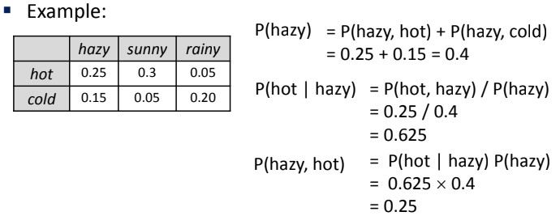

# L11 Uncertainty

- [L11 Uncertainty](#l11-uncertainty)
  - [Random Variable](#random-variable)
    - [Explanation](#explanation)
  - [Probability Distribution Table](#probability-distribution-table)
    - [Example](#example)
      - [Probability Rules](#probability-rules)
  - [Joint Distribution](#joint-distribution)
  - [Events](#events)
    - [Calculating Probability of an Event](#calculating-probability-of-an-event)
  - [Marginal Distributions](#marginal-distributions)
  - [Conditional Distributions](#conditional-distributions)
  - [Product Rule](#product-rule)
  - [Probabilistic Inference](#probabilistic-inference)
  - [Inference by enumeration](#inference-by-enumeration)

## Random Variable

An **aspect of the problem domain** which we **may have uncertainty** about

| Random Variable (RV) | Description                | Domain ($D$)  |
| -------------------- | -------------------------- | ------------- |
| D                    | Result from flipping a die | {1,2,3,4,5,6} |
| R                    | Raining?                   | {yes, no}     |
| M                    | Winning a football match   | {win, lose}   |

### Explanation

**Random Variable** : Always capital letters

**Domain** : Small letters enclosed in `{}`; A list of possible values

## Probability Distribution Table

Specifies the $P()$ of all the values (outcomes) for a given **RV**

### Example

| T    | P(T) |
| ---- | ---- |
| hot  | 0.6  |
| cold | 0.4  |

#### Probability Rules

- $\forall_x$ within the **RV**, $0 \leq P(x) \leq 1$
- Sum of all $P(x)$ is 1

## Joint Distribution

A table specifying the $P()$ for multiple **RV**s

**Probalistic Model** : joint distribution over a set of **RV**s

**Note** : The probability rules apply here too

## Events

It is a **set** of outcomes for the **set of RV** (inferred from Joint Distributions)

### Calculating Probability of an Event

Add up all the entries which are consistent with the event

$P(E) = \sum_{x_1, x_2, ..., x_n} P(x_1, x_2, ..., x_n)$ 

Example : Find the probability of hazy

`^` AND, `v` OR

Example Events

## Marginal Distributions

Sub-tables which **eliminates** certain variables

The process of **summing out**/**marginalization** helps us extract the distribution over some subset of variables

## Conditional Distributions

$P(W|T)$ is the probability of the weather given it is hot/cold

Example : Converting a joint distribution $P(W,T)$ to conditional

## Product Rule

$P(x,y) = P(x|y)P(y) \equiv P(x|y) = \frac{P(x,y)}{P(y)}$

Using that,

Refer to Slide 17,18 Example 2 and 3

## Probabilistic Inference

Compute a desired probability from other know probas (e.g conditional from joint)

## Inference by enumeration

