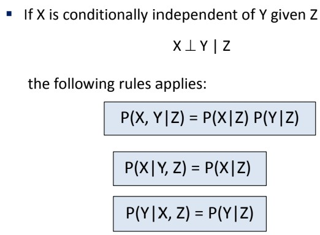

# Bayesian Network

- [Bayesian Network](#bayesian-network)
  - [Independence](#independence)
    - [Conditonality of Independent Variables](#conditonality-of-independent-variables)
    - [Simplifying Joint Distributions (Using $\perp$)](#simplifying-joint-distributions-using-perp)
  - [Conditonal Independence](#conditonal-independence)

## Independence

> An event is said to be **independent**  if it is not affected by other events

$\perp$ denotes independence

If 2 variables are independent

$P(x,y) = P(x) \cdot P(y)$ direct multiply (no product rule)

The Joint Distribution of Independent Variables can be obtained by multiplying their Marginal Distribution

### Conditonality of Independent Variables

Propeties (IFF Independent)

- $P(x|y) = P(x)$
- $P(y|x) = P(y)$

### Simplifying Joint Distributions (Using $\perp$)

Results in less entries in the joint, can split the independent vars into their own tables.

## Conditonal Independence

**Unconditional Independence** is rare; Focus on **conditional independence**

2 dependent variables **can become independent** when

- When other variables are taken into account
- At least 3 variables involved

