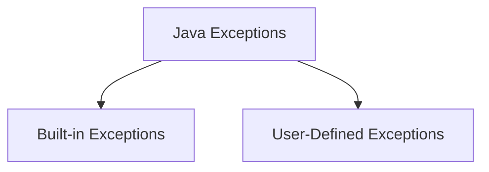
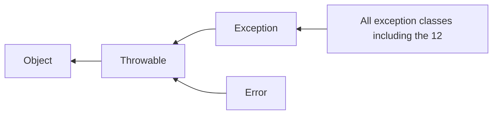
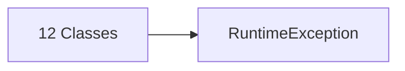

# Chapter 10

- [Chapter 10](#chapter-10)
  - [Exception Handling](#exception-handling)
    - [Exception Definition](#exception-definition)
    - [2 types of exceptions](#2-types-of-exceptions)
      - [Built-in Exceptions](#built-in-exceptions)
    - [Using exception-handling](#using-exception-handling)
      - [Direct Testing](#direct-testing)
      - [By invoking method](#by-invoking-method)
      - [Input mismatch](#input-mismatch)
    - [Declaring Exceptions](#declaring-exceptions)
    - [Catching Exceptions](#catching-exceptions)
    - [Benefits of Exception Handling](#benefits-of-exception-handling)
    - [Exception Class Methods](#exception-class-methods)
    - [Exception Class in the Java API](#exception-class-in-the-java-api)
  - [Checked and Unchecked Exceptions](#checked-and-unchecked-exceptions)
    - [Dealing with checked exceptions](#dealing-with-checked-exceptions)
    - [Order of Exception Classes](#order-of-exception-classes)
  - [Finally Block](#finally-block)
    - [Interesting Case](#interesting-case)
  - [Defining Own Exceptions](#defining-own-exceptions)
    - [Circle Radius Exception](#circle-radius-exception)

---

## Exception Handling

### Exception Definition

An **exception** is thrown when **runtime error** occurs

An **exception** is an object that:

- represents an error
- a condition that prevents the execution from proceeding normally

---

### 2 types of exceptions



#### Built-in Exceptions

Available in the Java library `java.lang`, **12 most important ones** are:

```java
Arithmetic Exception
//arithmetic error, e.g divide by zero

ArrayIndexOutOfBoundsException
//Illegal index for an array, either negative or larger than size

ClassNotFoundException
//Name implies

FileNotFoundException
//File not accessible

IOException
//When an IO operation has failed/interrupted

InterruptedException
//When thread is waiting/sleeping/doing something, and then is interrupted

NoSuchFieldException
//When class does not contain that field

NoSuchMethodException
//When trying to access a method which is not found in the class

NullPointerException
//When trying to access members of nothing

NumberFormatException
//Could not convert string to numeric format

RuntimeException
//Any exception that occurs during runtime

StringIndexOutOfBoundsException
//Index is either negative or larger than size of string

//Beyond here is extra
InputMismatchException
```

---

### Using exception-handling

#### Direct Testing

```java
try {
    result = num / denom;
    // here is a statement that might throw an exception
}
catch (ArithmeticException ex) {
    System.out.println("Attempted to divide by zero");
    // give a more meaningful message
}
```

#### By invoking method

```java
try {
    result = div(a,b);
    // invoking this method might throw an exception
}
catch (ArithmeticException ex) {
    System.out.println(ex);
    // print out the event object thrown in the method
}

public static int div(int a, int b) throws ArithmeticException {
    if (b == 0)
        throw new ArithmeticException("Divisor can not be 0");
        //error message

    return a / b;
}
```

#### Input mismatch

```java
try {
    // code here
    int number = input.nextInt(); //this method might cause exception
    // if exception occured here, proceed to catch block and ignore everything below
    System.out.println("Number is " + number);

}
catch (InputMismatchException ex) {
    System.out.println("Not a number!");
    // print out the event object thrown in the method
    input.nextLine(); //discard the input
}
```

---

### Declaring Exceptions

A **_checked_** exception must be delcared using `throws` at the method header, this is known as **declaring exceptions**

It is allowed to declare more than 1 exception

```java
public int method2() throws ArithmeticException, InputMismatchException, IOException {
    // code here
    // if error here
    if ()
        throw new ArithmeticException("Message");
        // fire the exception if the condition is met
        // this is known as throwing exception
        // the keyword throw is used in the method body to fire the exception
}
```

---

### Catching Exceptions

`try` block

- only the first exception reached is handled in the `catch` block(s)
- if no exceptions, all `catch` blocks are skipped

`catch` block

- Multiple blocks of this can be associated after 1 `try` block

---

### Benefits of Exception Handling

Separates the **detection** and **handling** of error

Detection - done in the callee
Handling - done in the caller

> Do not rely on EH to handle trivial problems, use IF ELSE to do so

---

### Exception Class Methods

```java
try {
    // some code that might throw exception
}
catch (AnyException e) {
    System.out.println(e) // implicit toString()
    // concats 1) Exception Name 2) " : " 3) getMessage()

    System.out.println(e.getMessage())
    // returns the message that describes this exception object

    e.printStackTrace();
    // prints the throwable object and its call stack trace info
}
```

---

### Exception Class in the Java API

The hierarchy



Users may define their own exception classes

The `Error` class rarely happens, when it happens nothing much can be done

The 12 classes inherits from the generic `RuntimeException` class



---

## Checked and Unchecked Exceptions

- **RuntimeException**, **Error** and their subclasses are **unchecked exceptions**. You do not need to write code to check it

- Everything else are known as **checked exceptions**, you must use `try catch` to deal with it

### Dealing with checked exceptions

If a method declares a checked exception, the caller must invoke the method in a

- `try catch` block
- Declare to throw the exception in the calling method

```java
void p1() {

    try {
        p2();
    } catch (IOException ex) {
        // handling here
    }

}
```

OR

```java
void p1() throws IOException {

    p2();

}
```

### Order of Exception Classes

The order of EX classes in the catch blocks are important

It is **wrong** to declare a supertype class before a general/subclass class

## Finally Block

Executes regardless after `try catch` block

Used to perform cleanup tasks (e.g closing a file)

```java
try {

} catch (Exception ex1) {

} finally {
    // code here goes regardless
}
```

### Interesting Case

```java
try {
    code1;
    code2;
    code3;
} catch (Exception1 ex) {
    handling ex;
    throw ex;
}
finally {
    statement;
}
```

Suppose code1 throws `Exception1`, the exception is handled, then the finally block is executed then it goes back to execute the `throw ex`

## Defining Own Exceptions

Must first extend from the `Exception` class or its subclasses

### Circle Radius Exception

In Circle.java

```java
class Circle {
    double radius;

    public Circle (double r) throws InvalidRadiusException {
        if (r <= 0)
            throw new InvalidRadiusException(r);
        else
            this.radius = r;
    }
}
```

In InvalidRadiusException.java

```java
class InvalidRadiusException extends Exception {

    public InvalidRadiusException (double r) {
        super("Invalid Radius: " + r); //Error message
    }

}
```
