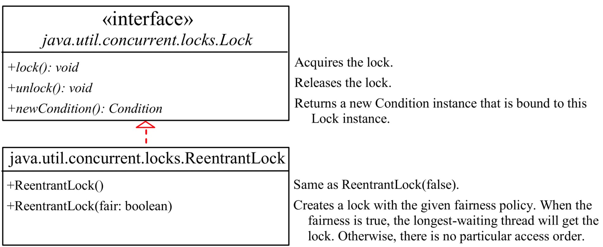

# Multithreading

- [Multithreading](#multithreading)
  - [Multitasking vs Multithreading](#multitasking-vs-multithreading)
  - [Java Thread Model](#java-thread-model)
    - [Advantages of Java Multithreading](#advantages-of-java-multithreading)
  - [How to create a thread](#how-to-create-a-thread)
    - [Creating a task and a thread](#creating-a-task-and-a-thread)
      - [Code](#code)
  - [The Thread Class](#the-thread-class)
    - [Notable Methods](#notable-methods)
  - [Lifecycle of Thread](#lifecycle-of-thread)
    - [Depreciated Methods](#depreciated-methods)
  - [Thread Pools](#thread-pools)
    - [Using the ExecutorService](#using-the-executorservice)
  - [Multithreading Problems](#multithreading-problems)
    - [More specialized critical region](#more-specialized-critical-region)

Running > 1 pieces of code concurrently, each piece of code is called a **thread**

| Term                    | Definition                                     |
| ----------------------- | ---------------------------------------------- |
| Single-threaded program | Executed sequentially                          |
| Multithreaded program   | Many tasks of a program running concurrently   |
| Thread                  | Flow of execution, from start to end of a task |

## Multitasking vs Multithreading

Slide 7 Lecture

## Java Thread Model

A thread in Java exists in several states

- **New** : A newly instantiated Thread object
- **Running** : Name implies
- **Suspended** : Same as pausing, can be resumed
- **Blocked** : Can happen when waiting for resource
- **Terminated** : Halts completely, no resume

### Advantages of Java Multithreading

- Threads are independent
- Saves time
- Exception in a thread doesn't affect another

## How to create a thread

2 ways to do it

- Implementing the `Runnable` interface (Covered Here)
- Extending the `Thread` class (Refer JenkovTutorial)

### Creating a task and a thread

In a nutshell

**Tasks** are objects of a class (`Task` class) that **implements** the `Runnable` interface

The method `run()` needs to be overridden from the interface

Soooo a `Task` **must be executed** in a `Thread` (using the constructor)

then by invoking the `.start()` method

> **Threads have a default value of 5**

#### Code

In CustomTask.java

```java
public class myTask implements Runnable {
  public TaskClass() {
    // Constructor
  }

  // From the Runnable
  public void run() {
    // The task code
  }
}
```

In ThreadApp.java

```java
public class ThreadApp {
  public static void main (String[] args) {
    myTask taskForThread1 = new myTask();

    Thread thread1 = new Thread(taskForThread1);

    thread1.start(); // Executes the run() method
  }
}
```

## The Thread Class


### Notable Methods

| Name                    | Type     | Description                                                                                                                                                     |
| ----------------------- | -------- | --------------------------------------------------------------------------------------------------------------------------------------------------------------- |
| `sleep(long millis)`    | static   | Sleeps the current thread; lets other threads to execute; raises `InterruptedException` (checked)                                                               |
| `yield()`               | static   | temporarily release time for other threads                                                                                                                      |
| `setPriority(int arg0)` | instance | From 1 to 10 (Low to High), higher priority is executed first when queued using `.start()`                                                                      |
| `join()`                | instance | Forces one thread to wait for another thread to die before it can execute                                                                                       |
| `isAlive()`             | instance | True if `Ready/Blocked/Running`, False if `new/terminated`                                                                                                      |
| `interrupt()`           | instance | **Rarely invoked**, if it is `Ready/Running`, set interrupted to true; if blocked, it is awakened and enters `Ready` state, an `InterruptedException` is thrown |
|`isInterrupt()`|instance| Check if a thread is stopping what it is originally doing and doing something else instead

## Lifecycle of Thread


### Depreciated Methods

`stop()` - kills the thread, assign `null` instead
`suspend()` - puts the the thread to wait until `.resume()` is called

## Thread Pools

`Executor` interface for executing tasks in a thread pool
`ExecutorService` interface for managing and controlling tasks

It is to limit the number of threads running concurrently


### Using the ExecutorService

`ExecutorService executor = Executors.newFixedThreadPool(3);`

3 threads will be limited to run at the same time

## Multithreading Problems

**Race Condition** : accessing a common resource in a way that causes conflict; class must be **thread-safe** to prevent this problem.

To prevent Race Condition

Use the `synchronized` keyword to access a method to allow only 1 thread at a time, such part of code is called the **Critical Region**

**OR**

```java
public void deposit(double amount) {
    synchronized(this) {
        //code here
    }
}
```

### More specialized critical region

Use the `ReentrantLock` class (implements `Lock`) for resource sharing



```java
private Lock lock = new ReentrantLock();

public void deposit(int amount) {
    lock.lock();
    // Critical Region Code
    lock.unlock();
}
```
