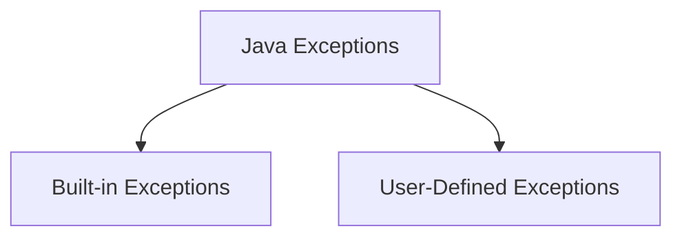

# Chapter 10

- [Chapter 10](#chapter-10)
  - [Exception Handling](#exception-handling)
    - [Exception Definition](#exception-definition)
    - [2 types of exceptions](#2-types-of-exceptions)
      - [Built-in Exceptions](#built-in-exceptions)
    - [Using exception-handling](#using-exception-handling)
      - [Direct Testing](#direct-testing)
      - [By invoking method](#by-invoking-method)
      - [Input mismatch](#input-mismatch)
    - [Declaring Exceptions](#declaring-exceptions)

---

## Exception Handling

### Exception Definition

An **exception** is thrown when **runtime error** occurs

An **exception** is an object that:

- represents an error
- a condition that prevents the execution from proceeding normally

---

### 2 types of exceptions



#### Built-in Exceptions

Available in the Java library `java.lang`, **12 most important ones** are:

```java
Arithmetic Exception
//arithmetic error, e.g divide by zero

ArrayIndexOutOfBoundsException
//Illegal index for an array, either negative or larger than size

ClassNotFoundException
//Name implies

FileNotFoundException
//File not accessible

IOException
//When an IO operation has failed/interrupted

InterruptedException
//When thread is waiting/sleeping/doing something, and then is interrupted

NoSuchFieldException
//When class does not contain that field

NoSuchMethodException
//When trying to access a method which is not found in the class

NullPointerException
//When trying to access members of nothing

NumberFormatException
//Could not convert string to numeric format

RuntimeException
//Any exception that occurs during runtime

StringIndexOutOfBoundsException
//Index is either negative or larger than size of string

//Beyond here is extra
InputMismatchException
```

---

### Using exception-handling

#### Direct Testing

```java
try {
    result = num / denom;
    // here is a statement that might throw an exception
}
catch (ArithmeticException ex) {
    System.out.println("Attempted to divide by zero");
    // give a more meaningful message
}
```

#### By invoking method

```java
try {
    result = div(a,b);
    // invoking this method might throw an exception
}
catch (ArithmeticException ex) {
    System.out.println(ex);
    // print out the event object thrown in the method
}

public static int div(int a, int b) throws ArithmeticException {
    if (b == 0)
        throw new ArithmeticException("Divisor can not be 0");
        //error message

    return a / b;
}
```

#### Input mismatch

```java
try {
    // code here
    int number = input.nextInt(); //this method might cause exception
    // if exception occured here, proceed to catch block and ignore everything below
    System.out.println("Number is " + number);

}
catch (InputMismatchException ex) {
    System.out.println("Not a number!");
    // print out the event object thrown in the method
    input.nextLine(); //discard the input
}
```

---

### Declaring Exceptions

A ***checked*** exception must be delcared using `throws` at the method header, this is known as **declaring exceptions**

It is allowed to declare more than 1 exception

```java
public int method2() throws ArithmeticException, InputMismatchException, IOException {
    // code here
    // if error here
    if ()
        throw new ArithmeticException("Message");
        // fire the exception if the condition is met
        // this is known as throwing exception
        // the keyword throw is used in the method body to fire the exception
}
```

