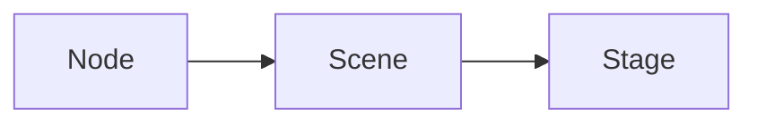
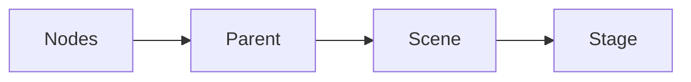
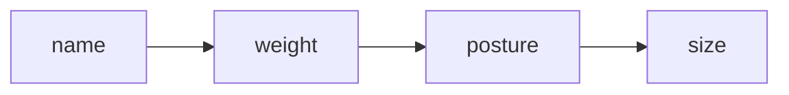
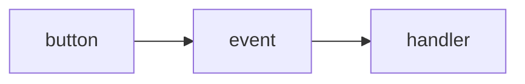

# JavaFX

[TOC]

## Sample JavaFX Program

```java
public guiApp extends Application { //Application class provides all JavaFx components 
    @Override //must implement this method as it is abstract
    public void start(Stage primaryStage) {
        //Node
        Button btOK = new Button("OK");
        //Scening
        Scene scene = new Scene(btOK, 200, 250);
        //Staging
        primaryStage.setScene(scene);
        primaryStage.setTitle("Test");
        primaryStage.setResizable(false); //The user can't maximize the window
        primaryStage.show();
    }
    
    public static void main(String[] args) {
        launch(args); //launching the JavaFX application
    }
}
```

## Hierarchy



 A **node** resides in a **scene** (node container), and the **scene** is placed in a **stage**.

---



A parent could be a **Pane** or **UI control**, and a **Pane** is the following, 

- `FlowPane`
- `GridPane`
- `BorderPane`
- `HBox`
- `VBox`
- `StackPane`

## Scene

```java
//Scene constructor (2 types)
Scene scene1 = new Scene(Parent, width, height);
Scene scene2 = new Scene(Parent);
```

Scene must **contain a parent**, not a ***Shape/ImageView***

---

```java
StackPane pane = new StackPane();
pane.getChildren().add(new Button("OK")); //addAll, remove, removeAll
```

Adding a **parent to a scene (pane)**

---

## Java Coordinate

Begins in the top left most point (0,0)

LR (x-axis)

TD (y-axis)

## Property Binding

Enables a ==target object== to be bound to a ==source object==, target changes when source changes

| Target Object    | Source Object     |
| ---------------- | ----------------- |
| Binding Object   | Bindable Object   |
| Binding Property | Observable Object |

```java
//target.bind(source)
//example

Circle circle1 = new Circle(100, 100, 50) // (x, y, radius)
circle1.centerXProperty().bind(pane.widthProperty().divide(2));
circle1.centerYProperty().bind(pane.heightProperty().divide(2));

//now the circle would change according to the pane size
```

## Layout Panes

| Class      | Description                                            |
| ---------- | ------------------------------------------------------ |
| Pane       | Base class for panes                                   |
| StackPane  | Stacks nodes on top of each other in the center        |
| FlowPane   | Row-by-row horizontally or column-by-column vertically |
| GridPane   | 2D Grid                                                |
| BorderPane | Top Right Left Right Center                            |
| HBox       | Places nodes in a single row                           |
| VBox       | Places nodes in a single column                        |

---

### FlowPane

The data fields: **alignment**, **orientation**, **hgap** and **vgap** and binding propeties

```java
FlowPane pane1 = new FlowPane(); //Default pane, no gaps, horizontal
FlowPane pane2 = new FlowPane(Orientation.VERTICAL, 5, 10);

//FlowPane methods:
pane2.setAlignment(Pos.CENTER);
pane2.setHgap(5);
pane2.setVgap(5);
pane2.setPadding(new Insets(10, 15, 10, 15)); //clockwise
flow.setPrefWrapLength(300);
```

---

### GridPane

Nodes are added using

```java
GridPane mat1 = new GridPane();
mat1.add(new Button(), 0, 0); //node, col, row, colspan, rowspan
GridPane.setHalignment(new Button("add"), HPos.RIGHT);
mat1.setGridLinesVisible(true); //for debugging purposes
```

---

### BorderPane

No space allocated, if no node in the region

---

### HBox VBox

```java
//HBox and VBox can set margins
VBox.setMargin(course, new Insets(0, 0, 0, 15));
```

---

### Setting Node Styles

Use CSS

```java
node.setStyle("-fx-styleName:value"); //property value pair

//Example
circle.setStyle("-fx-stroke: black; -fx-fill: red;");
hBox.setStyle("-fx-background-color: gold;");
```

---

## Shape

You may set shape properties using shape methods, instead of CSS

```java
shapeObj.setStroke(Color.BLACK);
shapeObj.setFill(Color.RED);
shapeObj.setStrokeWidth(5);
```

## Text

```java
Text text2 = new Text(60, 60, "Programming is fun"); //x,y position based on left-bottom corner
```

## Font Class

```java
Font font1 = new Font("SansSerif", 16);
Font font2 = Font.font("Times New Roman", FontWeight.BOLD, FontPosture.ITALIC, 12);
```



Follow the order of the diagram

| Property | Values                                  |
| -------- | --------------------------------------- |
| name     | "Times", "Courier", "Arial"             |
| weight   | FontWeight.NORMAL, FontWeight.BOLD      |
| posture  | FontPosture.REGULAR, FontPosture.ITALIC |
| size     | default = 12                            |

## Line Class

Connects 2 lines with 4 parameters

```java
Line line1 = new Line(10, 10, 30, 20); //startX, startY, endX, endY
```

## Rectangle Class

```java
Rectangle r2 = new Rectangle(30, 100, 70, 40); //x,y,width,height
r2.setArcWidth(15);
r2.setArcHeight(25);
```

## Circle Class

```java
Circle circle = new Circle(25, 25, 50); //x, y, radius
```

## Ellipse Class

```java
Ellipse e1 = new Ellipse(150, 100, 100, 50); //centerX, centerY, radiusX, radiusY
```

## Arc Class

Part of an ellipse

```java
Arc arc1 = new Arc(150, 100, 100, 50, 60, 100) //x, y, radX, radY, startAngle, spanAngle
```

# Java Event Handling

Connect the event source object and the event handler/listener



When a button is clicked, it fires an **ActionEvent**, the handler processes the **ActionEvent**

```java
class MainApp extends Application {
    public void start(Stage primaryStage) {
        OkHandlerClass handler1 = new OkHandlerClass();
        btOk.setOnAction(handler1) //Step 1: Registering the handler
    }
    
    class OKHandlerClass implements EventHandler<ActionEvent> { //Implementing an action event handler class
   		@Override
    	public void handle(ActionEvent e) {
        	System.out.println("OK Button Clicked");
    	}
	}
}
```

Above shows the usage of an inner class event handler

---

## Identifying source of event

use the `e.getSource()`

## Anonymous Inner Classes

```java
btOk.setOnAction(new EventHandler<ActionEvent>() {
    public void handle(ActionEvent e) {
        System.out.println("OK Button Clicked");
    }
});
```

## Lambda Expression

```java
btEnlarge.setOnAction(e -> {
   //Code here 
});

//4 styles of lambda
btEnlarge.setOnAction((ActionEvent e) -> {
   //Code here 
});

btEnlarge.setOnAction((e) -> {
   //Code here 
});

btEnlarge.setOnAction(e -> {
   //Code here 
});

btEnlarge.setOnAction(e -> System.out.println("Process Print"));
```

## JavaFX UI Controls

### Label

```java
Label();
Label(String text);
Label(String text, Node graphic);

//Testing
Label lb = new Label("First Name: ");
ImageView us = new ImageView("us.gif"); //must be in the same directory as .java file
Label lb1 = new Label("US 50 States", us);
lb1.setStyle("-fx-border-color: green; -fx-border-width: 2");
lb1.setContentDisplay(ContentDisplay.BOTTOM);
lb1.setTextFill(Color.RED);
```

### Button

```java
Button();
Button(String text);
Button(String text, Node graphic);

//Testing
Button btLeft = new Button("Left", new ImageView("left.gif"));
Button btCenter = new Button("Center");
btCenter.setPrefHeight(30);
Button btRigh = new Button("Right", new ImageView("right.gif"));
```

### CheckBox

```java
CheckBox();
CheckBox(String text);

//Testing
CheckBox chkBold = new CheckBox("Bold");
CheckBox chkBold = new CheckBox("Italic");
chkBold.setSelected(true);
chkItalic.setSelected(true);
chkItalic.setDisable(true);
```

### RadioButton

```java
RadioButton rbRed = new RadioButton("Red");
RadioButton rbGreen = new RadioButton("Green");
RadioButton rbBlue = new RadioButton("Blue");

ToggleGroup group = new ToggleGroup();
rbRed.setToggleGroup(group);
rbGreen.setToggleGroup(group);
rbBlue.setToggleGroup(group);
```

### TextField

```java
TextField();
TextField(String text);

TextField tf = new TextField("Testing");
tf.setEditable(false);
tf.setFont(Font.font("Times", 20));
double val = Double.parseDouble(tf.getText());
```

### TextArea

```java
TextArea();
TextArea(String text);

TextArea taNote = new TextArea("This is a text area");
taNote.setPrefColumnCount(20); //Default = 40
taNote.setPrefRowCount(5); //Default = 10
taNote.setWrapText(true); 
```

### ComboBox

Drop-down list

```java
ComboBox<String> cbo = new ComboBox<String>();
cbo.getItems.addAll("Item 1", "Item 2", "Item 3", "Item 4");
cbo.setStyle("-fx-color: red");
cbo.setValue("Item 2");

String selected = cbo.getValue();

//ObservableList
String[] itemArray = {"Item 1", "Item 2"};
ObservableList<String> items = FXCollections.observableArrayList(itemArray);
ComboBox<String> cbo = new ComboBox<String>(items);

cbo.getItems().addAll(items);
```

## Mouse Events

